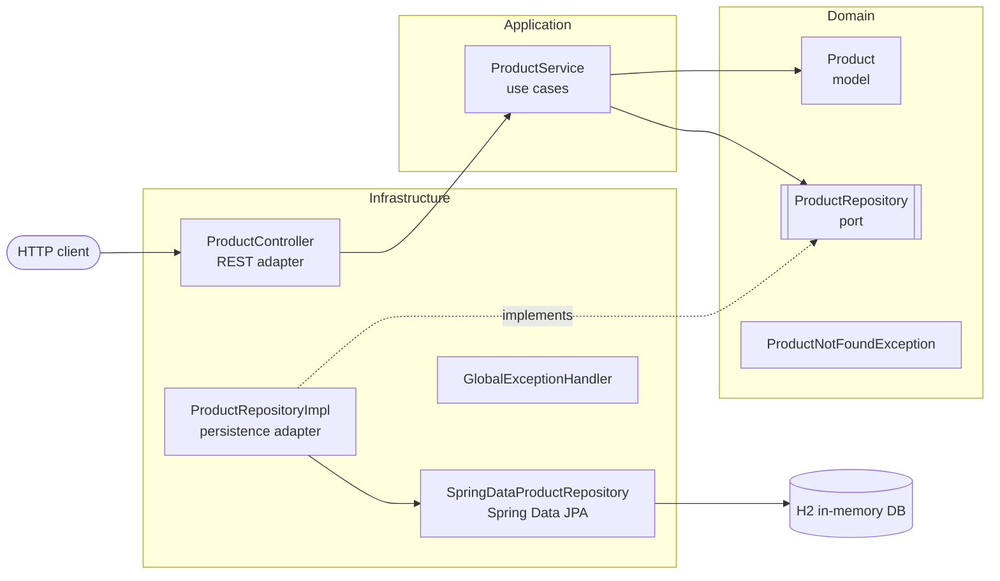

# App Example

A Spring Boot REST API for managing a product catalog (CRUD), built with Hexagonal Architecture and an in-memory H2 database.


> 🇪🇸 Leer en español: [README_es.md](README_es.md)

## Table of Contents

- [Overview](#overview)
- [Requirements](#requirements)
- [Quick Start](#quick-start)
- [API Reference](#api-reference)
- [Database](#database)
- [Testing](#testing)
- [Project Structure](#project-structure)
- [Configuration](#configuration)
- [Further Reading](#further-reading)
- [Contributing](#contributing)
- [License](#license)

## Overview

This project is a reference example for developers who want to see how a small Spring Boot service can be organized using **Hexagonal Architecture** (also known as *Ports and Adapters*). The business logic is isolated from frameworks and infrastructure, which keeps it easy to test and to change.



| Layer | Responsibility | Main classes |
|-------|----------------|--------------|
| **Domain** | Core business model and the interfaces (ports) it depends on. No framework code. | `Product`, `ProductRepository`, `ProductNotFoundException` |
| **Application** | Use cases that orchestrate the domain. | `ProductService` |
| **Infrastructure** | Adapters to the outside world: REST, JPA persistence and error handling. | `ProductController`, `ProductEntity`, `SpringDataProductRepository`, `ProductRepositoryImpl`, `GlobalExceptionHandler` |

## Requirements

- **Java 17** or later (JDK)
- **Maven 3.6** or later
- Optional: an IDE such as IntelliJ IDEA, Eclipse or VS Code

Main dependencies (managed in [`pom.xml`](pom.xml)): Spring Boot 3.2 (Web, Data JPA), H2 Database, JUnit 5 and Mockito.

## Quick Start

```bash
# 1. Clone the repository
git clone https://github.com/jorge-ls/app-example.git
cd app-example

# 2. Build and run the tests
mvn clean test

# 3. Start the application (http://localhost:8080)
mvn spring-boot:run
```

Alternatively, build an executable JAR and run it:

```bash
mvn clean package
java -jar target/app-example-1.0.0.jar
```

## API Reference

Base URL: `http://localhost:8080/api/products`

| Method | Path | Description | Success | Errors |
|--------|------|-------------|---------|--------|
| `POST` | `/api/products` | Create a product | `201 Created` | — |
| `GET` | `/api/products` | List all products | `200 OK` | — |
| `GET` | `/api/products/{id}` | Get a product by ID | `200 OK` | `404 Not Found` |
| `PUT` | `/api/products/{id}` | Update a product | `200 OK` | `404 Not Found` |
| `DELETE` | `/api/products/{id}` | Delete a product | `204 No Content` | `404 Not Found` |

### Request body (`POST` and `PUT`)

```json
{
  "name": "Keyboard",
  "description": "Mechanical keyboard",
  "price": 49.99,
  "stock": 10
}
```

### Examples

```bash
# Create a product
curl -X POST http://localhost:8080/api/products \
  -H "Content-Type: application/json" \
  -d '{"name":"Keyboard","description":"Mechanical keyboard","price":49.99,"stock":10}'

# List all products
curl http://localhost:8080/api/products

# Get a product by ID
curl http://localhost:8080/api/products/1

# Update a product
curl -X PUT http://localhost:8080/api/products/1 \
  -H "Content-Type: application/json" \
  -d '{"name":"Keyboard","description":"Wireless mechanical keyboard","price":59.99,"stock":8}'

# Delete a product
curl -X DELETE http://localhost:8080/api/products/1
```

### Response example

```json
{
  "id": 1,
  "name": "Keyboard",
  "description": "Mechanical keyboard",
  "price": 49.99,
  "stock": 10,
  "createdAt": "2024-01-01T10:00:00",
  "updatedAt": "2024-01-01T10:00:00"
}
```

### Error responses

When a product does not exist, the API returns `404 Not Found` with a JSON body produced by `GlobalExceptionHandler`:

```json
{
  "timestamp": "2024-01-01T10:00:00",
  "status": 404,
  "error": "Not Found",
  "message": "Product not found with id: 99"
}
```

## Database

The application uses an **in-memory H2 database**, so data is lost every time the application stops. Tables are created automatically on startup.

The H2 web console is enabled for development:

| Setting | Value |
|---------|-------|
| URL | `http://localhost:8080/h2-console` |
| JDBC URL | `jdbc:h2:mem:testdb` |
| User | `sa` |
| Password | *(empty)* |

## Testing

The project includes unit tests for every layer:

| Test class | What it covers |
|------------|----------------|
| `ProductTest` | Domain model |
| `ProductServiceTest` | Application service (with Mockito) |
| `ProductRepositoryImplTest` | Persistence adapter |
| `ProductControllerTest` | REST controller (with MockMvc), including `404` cases |

```bash
# Run all tests
mvn test

# Run a single test class
mvn test -Dtest=ProductServiceTest
```

## Project Structure

```
src/
├── main/
│   ├── java/com/example/app/
│   │   ├── AppApplication.java          # Spring Boot entry point
│   │   ├── domain/                      # Business core (no framework dependencies)
│   │   │   ├── model/                   # Product
│   │   │   ├── port/                    # ProductRepository (outbound port)
│   │   │   └── exception/               # ProductNotFoundException
│   │   ├── application/
│   │   │   └── service/                 # ProductService (use cases)
│   │   └── infrastructure/
│   │       ├── controller/              # ProductController (REST adapter)
│   │       ├── persistence/             # JPA entity, Spring Data repo, port implementation
│   │       └── exception/               # GlobalExceptionHandler
│   └── resources/
│       └── application.properties       # Application configuration
└── test/java/com/example/app/           # Unit tests, mirroring the main packages
```

## Configuration

Settings live in [`src/main/resources/application.properties`](src/main/resources/application.properties):

- `server.port` — HTTP port (default `8080`)
- `spring.datasource.*` — H2 in-memory datasource
- `spring.jpa.hibernate.ddl-auto=create-drop` — schema is recreated on every start
- `spring.jpa.show-sql=true` — SQL statements are logged
- `spring.h2.console.enabled=true` — H2 console enabled at `/h2-console`

Any property can be overridden at startup, for example to change the port:

```bash
mvn spring-boot:run -Dspring-boot.run.arguments=--server.port=9090
```

## Further Reading

- [Hexagonal Architecture (Alistair Cockburn)](https://alistair.cockburn.us/hexagonal-architecture/)
- [Spring Boot documentation](https://docs.spring.io/spring-boot/docs/3.2.x/reference/html/)
- [Spring Data JPA documentation](https://docs.spring.io/spring-data/jpa/reference/)
- [H2 Database](https://www.h2database.com/)

## Contributing

Issues and pull requests are welcome. To contribute:

1. Fork the repository and create a branch from `main`.
2. Keep the layer boundaries: domain code must not depend on Spring or JPA.
3. Add or update tests and make sure `mvn test` passes.
4. Open a pull request describing your change.

## License

No license has been specified for this project yet. Until a `LICENSE` file is added, all rights are reserved by the repository owner.

---

_Originally written and maintained by contributors and [Devin](https://app.devin.ai), with updates from the core team._
