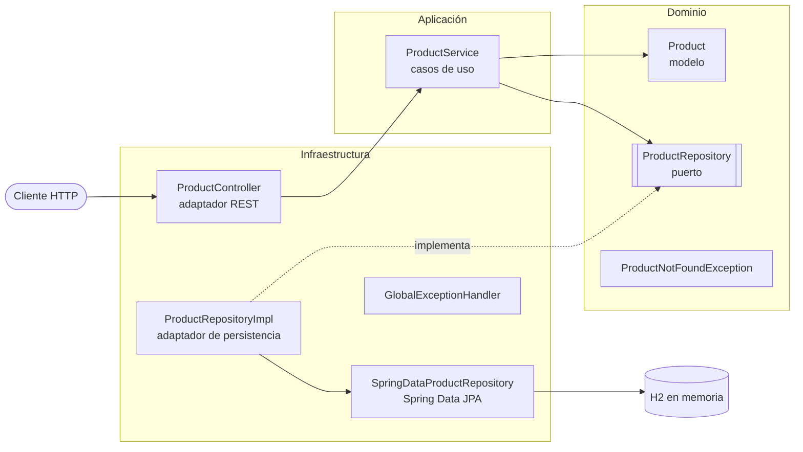

# App Example

API REST con Spring Boot para gestionar un catálogo de productos (CRUD), construida con Arquitectura Hexagonal y una base de datos H2 en memoria.


> 🇬🇧 Read in English: [README.md](README.md)

## Tabla de Contenidos

- [Descripción General](#descripción-general)
- [Requisitos](#requisitos)
- [Inicio Rápido](#inicio-rápido)
- [Referencia de la API](#referencia-de-la-api)
- [Base de Datos](#base-de-datos)
- [Tests](#tests)
- [Estructura del Proyecto](#estructura-del-proyecto)
- [Configuración](#configuración)
- [Documentación Adicional](#documentación-adicional)
- [Contribuir](#contribuir)
- [Licencia](#licencia)

## Descripción General

Este proyecto es un ejemplo de referencia para desarrolladores que quieran ver cómo organizar un servicio Spring Boot pequeño usando **Arquitectura Hexagonal** (también conocida como *Puertos y Adaptadores*). La lógica de negocio está aislada de los frameworks y de la infraestructura, lo que facilita probarla y modificarla.



| Capa | Responsabilidad | Clases principales |
|------|-----------------|--------------------|
| **Dominio** | Modelo de negocio y las interfaces (puertos) de las que depende. Sin código de frameworks. | `Product`, `ProductRepository`, `ProductNotFoundException` |
| **Aplicación** | Casos de uso que orquestan el dominio. | `ProductService` |
| **Infraestructura** | Adaptadores hacia el exterior: REST, persistencia JPA y gestión de errores. | `ProductController`, `ProductEntity`, `SpringDataProductRepository`, `ProductRepositoryImpl`, `GlobalExceptionHandler` |

## Requisitos

- **Java 17** o superior (JDK)
- **Maven 3.6** o superior
- Opcional: un IDE como IntelliJ IDEA, Eclipse o VS Code

Dependencias principales (gestionadas en [`pom.xml`](pom.xml)): Spring Boot 3.2 (Web, Data JPA), H2 Database, JUnit 5 y Mockito.

## Inicio Rápido

```bash
# 1. Clonar el repositorio
git clone https://github.com/jorge-ls/app-example.git
cd app-example

# 2. Compilar y ejecutar los tests
mvn clean test

# 3. Arrancar la aplicación (http://localhost:8080)
mvn spring-boot:run
```

Como alternativa, genera un JAR ejecutable y ejecútalo:

```bash
mvn clean package
java -jar target/app-example-1.0.0.jar
```

## Referencia de la API

URL base: `http://localhost:8080/api/products`

| Método | Ruta | Descripción | Éxito | Errores |
|--------|------|-------------|-------|---------|
| `POST` | `/api/products` | Crear un producto | `201 Created` | — |
| `GET` | `/api/products` | Listar todos los productos | `200 OK` | — |
| `GET` | `/api/products/{id}` | Obtener un producto por ID | `200 OK` | `404 Not Found` |
| `PUT` | `/api/products/{id}` | Actualizar un producto | `200 OK` | `404 Not Found` |
| `DELETE` | `/api/products/{id}` | Eliminar un producto | `204 No Content` | `404 Not Found` |

### Cuerpo de la petición (`POST` y `PUT`)

```json
{
  "name": "Teclado",
  "description": "Teclado mecánico",
  "price": 49.99,
  "stock": 10
}
```

### Ejemplos

```bash
# Crear un producto
curl -X POST http://localhost:8080/api/products \
  -H "Content-Type: application/json" \
  -d '{"name":"Teclado","description":"Teclado mecánico","price":49.99,"stock":10}'

# Listar todos los productos
curl http://localhost:8080/api/products

# Obtener un producto por ID
curl http://localhost:8080/api/products/1

# Actualizar un producto
curl -X PUT http://localhost:8080/api/products/1 \
  -H "Content-Type: application/json" \
  -d '{"name":"Teclado","description":"Teclado mecánico inalámbrico","price":59.99,"stock":8}'

# Eliminar un producto
curl -X DELETE http://localhost:8080/api/products/1
```

### Ejemplo de respuesta

```json
{
  "id": 1,
  "name": "Teclado",
  "description": "Teclado mecánico",
  "price": 49.99,
  "stock": 10,
  "createdAt": "2024-01-01T10:00:00",
  "updatedAt": "2024-01-01T10:00:00"
}
```

### Respuestas de error

Cuando un producto no existe, la API devuelve `404 Not Found` con un cuerpo JSON generado por `GlobalExceptionHandler`:

```json
{
  "timestamp": "2024-01-01T10:00:00",
  "status": 404,
  "error": "Not Found",
  "message": "Product not found with id: 99"
}
```

## Base de Datos

La aplicación usa una **base de datos H2 en memoria**, por lo que los datos se pierden cada vez que la aplicación se detiene. Las tablas se crean automáticamente al arrancar.

La consola web de H2 está habilitada para desarrollo:

| Parámetro | Valor |
|-----------|-------|
| URL | `http://localhost:8080/h2-console` |
| JDBC URL | `jdbc:h2:mem:testdb` |
| Usuario | `sa` |
| Contraseña | *(vacía)* |

## Tests

El proyecto incluye tests unitarios para todas las capas:

| Clase de test | Qué cubre |
|---------------|-----------|
| `ProductTest` | Modelo de dominio |
| `ProductServiceTest` | Servicio de aplicación (con Mockito) |
| `ProductRepositoryImplTest` | Adaptador de persistencia |
| `ProductControllerTest` | Controlador REST (con MockMvc), incluidos los casos `404` |

```bash
# Ejecutar todos los tests
mvn test

# Ejecutar una única clase de test
mvn test -Dtest=ProductServiceTest
```

## Estructura del Proyecto

```
src/
├── main/
│   ├── java/com/example/app/
│   │   ├── AppApplication.java          # Punto de entrada de Spring Boot
│   │   ├── domain/                      # Núcleo de negocio (sin dependencias de frameworks)
│   │   │   ├── model/                   # Product
│   │   │   ├── port/                    # ProductRepository (puerto de salida)
│   │   │   └── exception/               # ProductNotFoundException
│   │   ├── application/
│   │   │   └── service/                 # ProductService (casos de uso)
│   │   └── infrastructure/
│   │       ├── controller/              # ProductController (adaptador REST)
│   │       ├── persistence/             # Entidad JPA, repositorio Spring Data, implementación del puerto
│   │       └── exception/               # GlobalExceptionHandler
│   └── resources/
│       └── application.properties       # Configuración de la aplicación
└── test/java/com/example/app/           # Tests unitarios, con la misma estructura de paquetes
```

## Configuración

La configuración está en [`src/main/resources/application.properties`](src/main/resources/application.properties):

- `server.port` — puerto HTTP (por defecto `8080`)
- `spring.datasource.*` — datasource H2 en memoria
- `spring.jpa.hibernate.ddl-auto=create-drop` — el esquema se recrea en cada arranque
- `spring.jpa.show-sql=true` — se registran las sentencias SQL en el log
- `spring.h2.console.enabled=true` — consola H2 habilitada en `/h2-console`

Cualquier propiedad puede sobrescribirse al arrancar, por ejemplo para cambiar el puerto:

```bash
mvn spring-boot:run -Dspring-boot.run.arguments=--server.port=9090
```

## Documentación Adicional

- [Arquitectura Hexagonal (Alistair Cockburn)](https://alistair.cockburn.us/hexagonal-architecture/)
- [Documentación de Spring Boot](https://docs.spring.io/spring-boot/docs/3.2.x/reference/html/)
- [Documentación de Spring Data JPA](https://docs.spring.io/spring-data/jpa/reference/)
- [H2 Database](https://www.h2database.com/)

## Contribuir

Los issues y pull requests son bienvenidos. Para contribuir:

1. Haz un fork del repositorio y crea una rama a partir de `main`.
2. Respeta los límites entre capas: el código de dominio no debe depender de Spring ni de JPA.
3. Añade o actualiza los tests y asegúrate de que `mvn test` pasa.
4. Abre un pull request describiendo tu cambio.

## Licencia

Este proyecto todavía no especifica una licencia. Hasta que se añada un archivo `LICENSE`, todos los derechos quedan reservados al propietario del repositorio.

---

_Escrito originalmente y mantenido por los colaboradores y [Devin](https://app.devin.ai), con actualizaciones del equipo principal._
